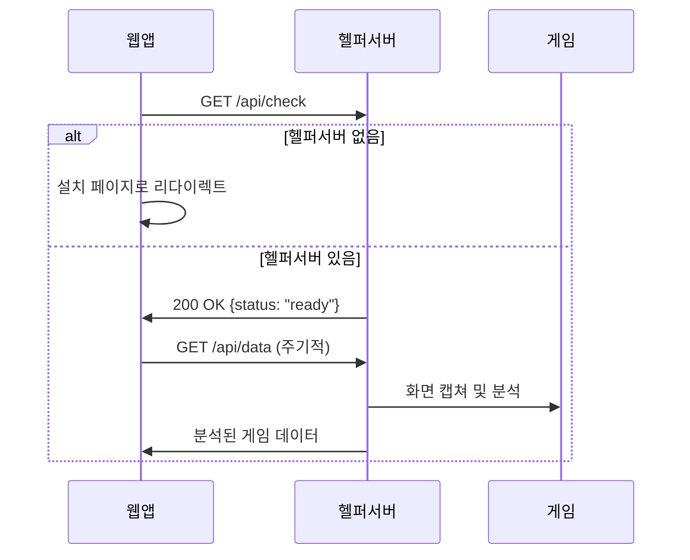
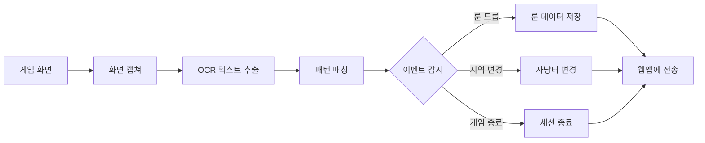

# Smith 헬퍼 서버 시스템 설계 문서

## 📋 개요

Smith 헬퍼 서버는 웹 애플리케이션과 로컬 데스크톱 환경을 연결하여 디아블로 2 게임의 자동 데이터 수집을 가능하게 하는 하이브리드 시스템입니다.

### 🎯 핵심 아이디어

- **웹앱의 편의성** + **네이티브 앱의 강력함**을 결합
- 사용자는 브라우저에서 데이터를 확인하고 관리
- 로컬 헬퍼 서버가 게임 화면을 자동 분석하여 데이터 수집
- 완전 자동화된 사냥터 추적 및 룬/아이템 기록

## 🏗️ 시스템 아키텍처

```
┌─────────────────┐    HTTP API    ┌─────────────────┐    Screen Capture    ┌─────────────────┐
│   웹 애플리케이션   │ ←──────────→ │  헬퍼 서버 (로컬)  │ ←─────────────────→ │   디아블로 2 게임   │
│                │               │                │                    │                │
│ - 데이터 시각화    │               │ - 화면 캡쳐/OCR    │                    │ - 채팅 로그       │
│ - 통계 대시보드    │               │ - 게임 분석 엔진    │                    │ - 아이템 드롭      │
│ - 설정 관리       │               │ - API 서버        │                    │ - 지역 정보       │
│ - 수동 입력 지원   │               │ - 데이터 동기화     │                    │ - 보스 전투       │
└─────────────────┘               └─────────────────┘                    └─────────────────┘
        │                                │
        │            Cloud Storage       │
        └──────────────────────────────────┘
                (선택적 백업)
```

## 🔄 데이터 플로우

### 1. 초기 연결 과정


### 2. 실시간 데이터 수집


## 🛠️ 기술 스택

### 웹 애플리케이션 (기존)
- **Frontend**: Next.js 15, TypeScript, Tailwind CSS
- **UI Library**: shadcn/ui
- **Charts**: Recharts
- **Storage**: LocalStorage + 헬퍼 서버 동기화

### 헬퍼 서버 (신규)
- **Backend**: Python FastAPI
- **Screen Capture**: `pyautogui`, `PIL`
- **OCR Engine**: `pytesseract` (Tesseract.js 대안)
- **Image Processing**: `opencv-python`
- **Game Detection**: `psutil`, `win32gui` (Windows)
- **HTTP Client**: `httpx`

## 📡 API 명세

### 웹앱 → 헬퍼서버 API

#### `GET /api/check`
헬퍼 서버 상태 확인
```json
// Response
{
  "status": "ready",
  "version": "1.0.0",
  "game_detected": true,
  "last_activity": "2024-01-01T12:00:00Z"
}
```

#### `GET /api/data`
최신 게임 데이터 조회
```json
// Response
{
  "current_area": {
    "id": "ancient-tunnels",
    "name": "고대의 터널",
    "detected_at": "2024-01-01T12:00:00Z"
  },
  "recent_loot": [
    {
      "type": "rune",
      "name": "벡스",
      "level": 26,
      "detected_at": "2024-01-01T11:58:30Z",
      "confidence": 0.95
    }
  ],
  "session_stats": {
    "runs_today": 15,
    "loot_count": 3,
    "session_start": "2024-01-01T10:00:00Z"
  }
}
```

#### `POST /api/settings`
헬퍼 서버 설정 변경
```json
// Request
{
  "capture_interval": 2000,
  "ocr_confidence_threshold": 0.8,
  "game_window_title": "Diablo II: Resurrected",
  "auto_detection": true
}

// Response
{
  "status": "updated",
  "settings": { /* 업데이트된 설정 */ }
}
```

#### `GET /api/screenshot`
수동 스크린샷 캡쳐 (디버깅용)
```json
// Response
{
  "image_base64": "data:image/png;base64,iVBORw0KGgoAAAANSUhEUgAA...",
  "detected_text": ["벡스 룬을 얻었습니다", "고대의 터널"],
  "analysis_result": {
    "area": "고대의 터널",
    "loot": ["벡스"]
  }
}
```

#### `POST /api/manual-add`
수동 데이터 추가
```json
// Request
{
  "type": "loot",
  "data": {
    "item_type": "rune",
    "name": "벡스",
    "area": "ancient-tunnels"
  }
}

// Response
{
  "status": "added",
  "id": "generated-id"
}
```

### 헬퍼서버 → 웹앱 동기화

#### `POST ${WEB_APP_URL}/api/sync`
헬퍼 서버가 웹앱으로 데이터 푸시 (선택적)
```json
// Request
{
  "session_id": "helper-session-123",
  "events": [
    {
      "type": "loot_drop",
      "data": { /* 룬/아이템 정보 */ },
      "timestamp": "2024-01-01T12:00:00Z"
    },
    {
      "type": "area_change",
      "data": { /* 지역 변경 정보 */ },
      "timestamp": "2024-01-01T12:01:00Z"
    }
  ]
}
```

## 🎮 게임 분석 엔진

### 화면 인식 전략

#### 1. 채팅 로그 영역 모니터링
```python
class ChatLogMonitor:
    def __init__(self, chat_region: tuple):
        self.chat_region = chat_region  # (x, y, width, height)
        self.last_messages = []

    def capture_chat(self) -> List[str]:
        """채팅 영역만 캡쳐하여 OCR 실행"""
        screenshot = pyautogui.screenshot(region=self.chat_region)
        text = pytesseract.image_to_string(screenshot, lang='kor+eng')
        return self.parse_messages(text)

    def detect_loot_drop(self, messages: List[str]) -> List[LootItem]:
        """룬/아이템 드롭 메시지 감지"""
        patterns = [
            r"(.+) 룬을 얻었습니다",
            r"(.+)을\(를\) 얻었습니다",
            r"(.+) 열쇠를 얻었습니다"
        ]
        # 패턴 매칭 로직
```

#### 2. 지역 감지
```python
class AreaDetector:
    def __init__(self):
        self.area_patterns = {
            "고대의 터널": ["Ancient Tunnels", "고대의 터널"],
            "메피스토": ["Durance of Hate", "증오의 지속"],
            # ... 더 많은 지역
        }

    def detect_current_area(self, screenshot) -> str:
        """미니맵이나 지역명 텍스트에서 현재 위치 감지"""
        # 1. 미니맵 영역 분석
        # 2. 지역명 텍스트 OCR
        # 3. 게임 내 UI 요소 매칭
```

#### 3. 게임 상태 감지
```python
class GameStateDetector:
    def detect_game_state(self) -> GameState:
        """게임 상태 감지 (메뉴, 인게임, 로딩 등)"""
        # 게임 창 활성화 상태
        # UI 요소 존재 여부
        # 캐릭터 생존 상태 등
```

### OCR 최적화 전략

#### 1. 전처리 파이프라인
```python
def preprocess_for_ocr(image):
    """OCR 정확도 향상을 위한 이미지 전처리"""
    # 1. 해상도 업스케일링
    # 2. 노이즈 제거
    # 3. 대비 증가
    # 4. 텍스트 영역만 추출
    # 5. 이진화
```

#### 2. 다중 OCR 엔진 활용
```python
class MultiOCREngine:
    def __init__(self):
        self.engines = [
            TesseractOCR(),
            EasyOCR(),  # 한글 지원 우수
            # PaddleOCR()  # 선택적
        ]

    def recognize_with_consensus(self, image) -> str:
        """여러 OCR 엔진 결과를 종합하여 정확도 향상"""
        results = [engine.recognize(image) for engine in self.engines]
        return self.find_consensus(results)
```

#### 3. 룬 이름 매핑 시스템
```python
RUNE_PATTERNS = {
    # OCR에서 자주 오인식되는 패턴들
    "백스": "벡스",
    "옴룬": "옴",
    "자룬": "자",
    # 영문-한글 매핑
    "Vex": "벡스",
    "Ohm": "옴",
    "Jah": "자"
}

def normalize_rune_name(raw_text: str) -> str:
    """OCR 결과를 정규화하여 정확한 룬 이름 반환"""
    # 패턴 매칭 및 보정 로직
```

## 💻 헬퍼 서버 구현

### 메인 서버 코드
```python
# helper_server/main.py
from fastapi import FastAPI, BackgroundTasks
from fastapi.middleware.cors import CORSMiddleware
import asyncio
from .game_monitor import GameMonitor
from .data_manager import DataManager

app = FastAPI(title="Smith Helper Server", version="1.0.0")

# CORS 설정 (웹앱에서 접근 허용)
app.add_middleware(
    CORSMiddleware,
    allow_origins=["http://localhost:3000", "https://smith.app"],
    allow_methods=["*"],
    allow_headers=["*"],
)

game_monitor = GameMonitor()
data_manager = DataManager()

@app.on_event("startup")
async def startup_event():
    """서버 시작시 게임 모니터링 시작"""
    asyncio.create_task(game_monitor.start_monitoring())

@app.get("/api/check")
async def health_check():
    return {
        "status": "ready",
        "version": "1.0.0",
        "game_detected": game_monitor.is_game_running(),
        "last_activity": game_monitor.last_activity
    }

@app.get("/api/data")
async def get_game_data():
    return data_manager.get_latest_data()

@app.post("/api/settings")
async def update_settings(settings: dict):
    game_monitor.update_settings(settings)
    return {"status": "updated", "settings": settings}
```

### 게임 모니터링 시스템
```python
# helper_server/game_monitor.py
import asyncio
import time
from typing import Optional
import psutil
import pyautogui
from .ocr_engine import OCREngine
from .pattern_matcher import PatternMatcher

class GameMonitor:
    def __init__(self):
        self.ocr_engine = OCREngine()
        self.pattern_matcher = PatternMatcher()
        self.monitoring = False
        self.last_activity = time.time()
        self.capture_interval = 2.0  # 2초마다 캡쳐

    async def start_monitoring(self):
        """게임 모니터링 시작"""
        self.monitoring = True
        while self.monitoring:
            try:
                if self.is_game_running():
                    await self.capture_and_analyze()
                await asyncio.sleep(self.capture_interval)
            except Exception as e:
                print(f"모니터링 에러: {e}")
                await asyncio.sleep(5)  # 에러시 5초 대기

    def is_game_running(self) -> bool:
        """디아블로 2 게임 실행 여부 확인"""
        for proc in psutil.process_iter(['name']):
            if 'diablo' in proc.info['name'].lower():
                return True
        return False

    async def capture_and_analyze(self):
        """화면 캡쳐 및 분석"""
        try:
            # 게임 창에 포커스
            game_window = self.find_game_window()
            if not game_window:
                return

            # 채팅 영역 캡쳐
            chat_screenshot = self.capture_chat_area(game_window)

            # OCR 실행
            text = await self.ocr_engine.analyze(chat_screenshot)

            # 패턴 매칭
            events = self.pattern_matcher.find_events(text)

            # 이벤트 처리
            for event in events:
                await self.handle_game_event(event)

            self.last_activity = time.time()

        except Exception as e:
            print(f"캡쳐/분석 에러: {e}")

    def find_game_window(self):
        """디아블로 2 게임 창 찾기"""
        # Windows: win32gui 사용
        # macOS: Quartz 사용
        # Linux: xdotool 사용
        pass

    def capture_chat_area(self, window) -> bytes:
        """채팅 영역만 캡쳐"""
        # 게임 창 내에서 채팅 영역 좌표 계산
        # 해당 영역만 스크린샷
        pass

    async def handle_game_event(self, event):
        """게임 이벤트 처리"""
        if event.type == "loot_drop":
            # 룬/아이템 드롭 이벤트
            await self.data_manager.add_loot(event.data)
        elif event.type == "area_change":
            # 지역 변경 이벤트
            await self.data_manager.update_area(event.data)
        elif event.type == "run_complete":
            # 런 완료 이벤트
            await self.data_manager.increment_run_count(event.data)
```

## 🌐 웹앱 통합 계획

### 헬퍼 서버 연동 로직
```typescript
// lib/helper-server.ts
class HelperServerClient {
  private baseUrl = 'http://localhost:19213';
  private isConnected = false;

  async checkConnection(): Promise<boolean> {
    try {
      const response = await fetch(`${this.baseUrl}/api/check`);
      this.isConnected = response.ok;
      return this.isConnected;
    } catch (error) {
      this.isConnected = false;
      return false;
    }
  }

  async getGameData() {
    if (!this.isConnected) {
      throw new Error('Helper server not connected');
    }

    const response = await fetch(`${this.baseUrl}/api/data`);
    return response.json();
  }

  async updateSettings(settings: any) {
    const response = await fetch(`${this.baseUrl}/api/settings`, {
      method: 'POST',
      headers: { 'Content-Type': 'application/json' },
      body: JSON.stringify(settings)
    });
    return response.json();
  }
}

export const helperServer = new HelperServerClient();
```

### 앱 시작시 연결 체크
```typescript
// app/layout.tsx
'use client'

import { useEffect, useState } from 'react';
import { helperServer } from '@/lib/helper-server';

export default function RootLayout({
  children,
}: {
  children: React.ReactNode
}) {
  const [helperConnected, setHelperConnected] = useState<boolean | null>(null);

  useEffect(() => {
    const checkHelper = async () => {
      const connected = await helperServer.checkConnection();
      setHelperConnected(connected);

      if (!connected) {
        // 설치 페이지로 리다이렉트
        window.location.href = '/install';
      }
    };

    checkHelper();

    // 주기적으로 연결 상태 체크
    const interval = setInterval(checkHelper, 10000);
    return () => clearInterval(interval);
  }, []);

  if (helperConnected === null) {
    return <div>헬퍼 서버 연결 확인 중...</div>;
  }

  if (!helperConnected) {
    return <div>헬퍼 서버를 설치해주세요.</div>;
  }

  return (
    <html lang="ko">
      <body>{children}</body>
    </html>
  );
}
```

### 설치 페이지 구현
```typescript
// app/install/page.tsx
export default function InstallPage() {
  const downloadHelper = () => {
    const platform = navigator.platform;
    let downloadUrl = '';

    if (platform.includes('Win')) {
      downloadUrl = '/downloads/smith-helper-windows.exe';
    } else if (platform.includes('Mac')) {
      downloadUrl = '/downloads/smith-helper-macos.pkg';
    } else {
      downloadUrl = '/downloads/smith-helper-linux.tar.gz';
    }

    window.open(downloadUrl, '_blank');
  };

  return (
    <div className="min-h-screen flex items-center justify-center">
      <Card className="max-w-md">
        <CardHeader>
          <CardTitle>Smith 헬퍼 서버 설치</CardTitle>
          <CardDescription>
            자동 게임 분석을 위해 헬퍼 서버를 설치해주세요
          </CardDescription>
        </CardHeader>
        <CardContent>
          <div className="space-y-4">
            <p className="text-sm text-muted-foreground">
              헬퍼 서버는 다음 기능을 제공합니다:
            </p>
            <ul className="list-disc list-inside text-sm space-y-1">
              <li>자동 룬/아이템 감지</li>
              <li>사냥터 자동 인식</li>
              <li>런 카운트 자동 증가</li>
              <li>실시간 통계 업데이트</li>
            </ul>
            <Button onClick={downloadHelper} className="w-full">
              헬퍼 서버 다운로드
            </Button>
          </div>
        </CardContent>
      </Card>
    </div>
  );
}
```

## 🚀 구현 단계별 계획

### Phase 1: 기본 헬퍼 서버 구축 (1주)
- [ ] FastAPI 기반 로컬 서버 구축
- [ ] 기본 API 엔드포인트 구현
- [ ] 게임 프로세스 감지 기능
- [ ] 간단한 화면 캡쳐 기능
- [ ] 웹앱과의 연결 테스트

### Phase 2: 게임 분석 엔진 개발 (2주)
- [ ] OCR 엔진 통합 및 최적화
- [ ] 채팅 로그 영역 감지 로직
- [ ] 룬/아이템 패턴 매칭 시스템
- [ ] 지역 감지 알고리즘
- [ ] 게임 상태 추적 시스템

### Phase 3: 웹앱 통합 및 고도화 (1주)
- [ ] 웹앱 헬퍼 서버 연동 로직
- [ ] 설치 페이지 UI 구현
- [ ] 자동/수동 모드 전환
- [ ] 실시간 데이터 동기화
- [ ] 에러 처리 및 복구 기능

### Phase 4: 배포 및 최적화 (1주)
- [ ] 크로스 플랫폼 빌드 시스템
- [ ] 원클릭 설치 프로그램
- [ ] 자동 업데이트 메커니즘
- [ ] 성능 최적화 및 디버깅
- [ ] 사용자 가이드 작성

## 📦 배포 전략

### 헬퍼 서버 패키징

#### Windows
```bash
# PyInstaller로 실행파일 생성
pip install pyinstaller
pyinstaller --onefile --windowed helper_server/main.py

# Inno Setup으로 설치 프로그램 생성
# smith-helper-setup.exe
```

#### macOS
```bash
# py2app으로 앱 번들 생성
pip install py2app
python setup.py py2app

# create-dmg로 DMG 파일 생성
# smith-helper.dmg
```

#### Linux
```bash
# AppImage로 포터블 실행파일 생성
# smith-helper.AppImage
```

### 자동 업데이트 시스템
```python
class AutoUpdater:
    def __init__(self):
        self.update_server = "https://updates.smith.app"
        self.current_version = "1.0.0"

    async def check_for_updates(self):
        """업데이트 확인"""
        response = await httpx.get(f"{self.update_server}/latest-version")
        latest_version = response.json()["version"]

        if self.is_newer_version(latest_version):
            return await self.download_update(latest_version)
        return False

    async def download_update(self, version: str):
        """업데이트 다운로드 및 설치"""
        # 플랫폼별 업데이트 파일 다운로드
        # 백그라운드에서 설치 진행
        # 재시작 후 새 버전 실행
```

## 🔒 보안 고려사항

### 1. 로컬 통신 보안
```python
# CORS 설정으로 웹앱만 접근 허용
app.add_middleware(
    CORSMiddleware,
    allow_origins=["https://smith.app", "http://localhost:3000"],
    allow_methods=["GET", "POST"],
    allow_headers=["*"],
)

# API 키 기반 인증 (선택적)
@app.middleware("http")
async def verify_api_key(request: Request, call_next):
    api_key = request.headers.get("X-API-Key")
    if api_key != get_local_api_key():
        raise HTTPException(401, "Unauthorized")
    return await call_next(request)
```

### 2. 게임 데이터 보안
- 개인 정보 포함하지 않음 (게임 내 데이터만)
- 로컬 저장소 암호화 (선택적)
- 클라우드 동기화시 암호화 전송

### 3. 시스템 권한
- 최소 권한으로 실행
- 화면 캡쳐 권한만 요청
- 게임 파일 수정 없음

## ⚡ 성능 최적화 전략

### 1. 캡쳐 최적화
```python
class OptimizedCapture:
    def __init__(self):
        self.last_screenshot = None
        self.change_threshold = 0.1

    def capture_if_changed(self):
        """변화가 있을 때만 캡쳐"""
        current = pyautogui.screenshot()

        if self.last_screenshot:
            diff = self.calculate_difference(current, self.last_screenshot)
            if diff < self.change_threshold:
                return None  # 변화 없음

        self.last_screenshot = current
        return current
```

### 2. OCR 최적화
- 텍스트 영역만 캡쳐하여 처리 속도 향상
- 이전 결과와 비교하여 중복 처리 방지
- 멀티스레딩으로 백그라운드 처리

### 3. 메모리 관리
- 캐시된 이미지 자동 정리
- 메모리 사용량 모니터링
- 가비지 컬렉션 최적화

## 🐛 에러 처리 및 복구

### 1. 게임 연결 실패
```python
class GameConnectionHandler:
    async def handle_game_not_found(self):
        """게임이 감지되지 않을 때 처리"""
        # 5분간 대기 후 재시도
        # 사용자에게 알림
        # 수동 모드로 전환 옵션 제공
```

### 2. OCR 실패
```python
class OCRErrorHandler:
    async def handle_ocr_failure(self, image, error):
        """OCR 실패시 복구 전략"""
        # 다른 OCR 엔진으로 재시도
        # 이미지 전처리 변경 후 재시도
        # 수동 확인 요청
```

### 3. 네트워크 오류
- 웹앱과의 연결 실패시 로컬 캐시 활용
- 연결 복구시 자동 동기화
- 오프라인 모드 지원

## 📊 로깅 및 디버깅

### 1. 상세 로깅
```python
import logging

logging.basicConfig(
    level=logging.INFO,
    format='%(asctime)s - %(name)s - %(levelname)s - %(message)s',
    handlers=[
        logging.FileHandler('helper_server.log'),
        logging.StreamHandler()
    ]
)

logger = logging.getLogger(__name__)

class GameEventLogger:
    def log_loot_drop(self, item_name, confidence):
        logger.info(f"Loot detected: {item_name} (confidence: {confidence})")

    def log_area_change(self, old_area, new_area):
        logger.info(f"Area change: {old_area} -> {new_area}")
```

### 2. 디버그 모드
- 캡쳐된 이미지 저장
- OCR 결과 상세 출력
- 패턴 매칭 과정 시각화

## 🎯 향후 확장 계획

### 1. 고급 분석 기능
- AI 기반 아이템 등급 판별
- 플레이 패턴 분석 및 최적화 제안
- 예상 드롭률 계산

### 2. 멀티플레이어 지원
- 파티 플레이 추적
- 멤버별 기여도 분석
- 공유 통계 대시보드

### 3. 확장된 게임 지원
- 디아블로 3, 4 지원
- Path of Exile 지원
- 다른 ARPG 게임 지원

### 4. 클라우드 기능
- 데이터 클라우드 백업
- 멀티 디바이스 동기화
- 커뮤니티 통계 비교

## 📋 요약

Smith 헬퍼 서버 시스템은 웹 애플리케이션의 편의성과 네이티브 애플리케이션의 강력함을 결합한 혁신적인 솔루션입니다.

**핵심 장점:**
- ✅ **완전 자동화**: 수동 입력 없이 게임 데이터 자동 수집
- ✅ **웹 접근성**: 브라우저에서 언제든 데이터 확인 가능
- ✅ **높은 정확도**: 다중 OCR 엔진과 패턴 매칭으로 정확한 감지
- ✅ **확장 가능**: 모듈형 구조로 새로운 기능 추가 용이
- ✅ **크로스 플랫폼**: Windows, macOS, Linux 모두 지원

**구현 복잡도:** 중-고급
**예상 개발 기간:** 4-5주
**유지보수:** 중간 수준

이 시스템이 완성되면 Smith는 단순한 수동 입력 도구에서 완전 자동화된 디아블로 2 분석 플랫폼으로 발전하게 됩니다.

---

*이 문서는 Smith 헬퍼 서버 시스템의 설계 기준점이며, 구현 과정에서 기술적 요구사항에 따라 조정될 수 있습니다.*